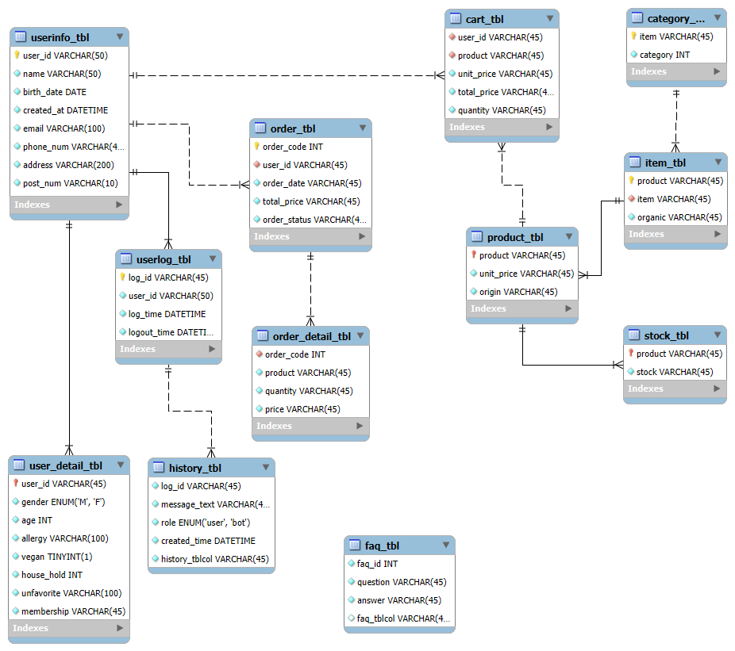

# 🥕 QOOK  
> 신선식품 고객응대용 챗봇

## 👨‍💻 팀원 소개 및 역할  
**팀명: 응대용**

**팀원: | 하종수 | 김광령 | 김성민 | 문상희 | 서은선 | 송유나 |**

# 프로젝트 개요
## 📖 프로젝트 주제
- **신선식품 플랫폼 고객 응대 챗봇**: 마켓컬리 FAQ·가이드 기반의 RAG 챗봇으로 상품 탐색, 주문/배송, 환불/교환 안내, 레시피 기반으로 상품 구매를 자동화합니다.

## 💡 주제 선정 및 배경
현재 신선식품 플랫폼은 FAQ가 풍부하게 제공되고 있지만 사용자가 **스스로 원하는 답을 찾기에는 어려움**이 있습니다. 이로 인해 고객들이 전화 문의에 몰리면서 **상담 대기 시간이 늘어나고**, 응답 지연 문제로 불편이 가중되고 있습니다.

또한 온라인 신선식품 시장이 꾸준히 성장함에도 불구하고 **CS 응답 지연, 상담 비용 증가, 고객 만족도 저하**와 같은 문제들이 여전히 존재합니다. 이러한 상황에서 기업은 반복적인 문의를 자동화하고 상담 효율성을 높이기를 원하며, 사용자는 빠르고 정확한 응답을 기대합니다.

최근 유통·커머스 분야에서는 **AI 챗봇의 도입**이 확대되고 있고, 기술 성숙도와 운영 사례가 점차 축적되면서 이러한 문제를 해결할 수 있는 가능성이 커지고 있습니다.

## ✅ 프로젝트 소개
1. **24시간 자동 응대**: 주문/배송, 환불/교환, 회원정보, 상품 구매 안내를 신속히 처리합니다.  
2. **RAG 파이프라인**: 운영정책·FAQ를 검색·인용하여 **정확성/추적성**을 확보합니다.  
3. **멀티 인터페이스**: 텍스트 중심(옵션: 음성) UI를 **Django 웹**에 통합합니다.  
4. **업무 에이전트**: 주문/배송 조회 안내, 교환·환불 절차 가이드, 회원정보 변경 안내 등 **분기형 플로우**를 제공합니다.  

# 📜 문제 해결 방향 및 기대효과
### 해결 방향
- **RAG 기반 검색·인용**으로 최신 정책/FAQ를 정확히 반영하고 출처를 제시합니다.  
- **프롬프트 제어 + 상담 톤 파인튜닝**으로 일관된 말투와 안전한 응답을 제공합니다.  
- **분기형 대화 흐름**: 상품구매 / 주문·배송 / 환불·교환 / 회원정보 수정으로 빠른 경로를 안내합니다.  
- **상담원 핸드오프**: 난이도·감정 신호 기반 연결과 **요약 전달**로 현장 처리 효율을 높입니다.  

### 기대효과
- **1차 문의 자가 해결률 상승**, 상담 대기·부하 감소  
- **응답 시간 단축**과 **이탈률 감소**, 고객 만족도 향상  
- 구매 여정 안내 강화로 **전환율·재구매율 개선**  
- **운영 비용 절감** 및 플랫폼 **경쟁력 강화**

## 🔍 주요기능
### 🛒 상품 검색 & 구매
> 원하는 상품을 검색하고 선택하여 장바구니에 담고 결제까지 진행  

- 상품 검색 및 선택  
- 장바구니 담기
- 안전한 결제 진행  

### 🧑‍🍳 레시피 기반 장바구니 자동 구성
> 요리 레시피를 검색하면 필요한 재료를 자동 추천하고 장바구니에 담을 수 있음  

- 레시피 검색  
- 필요한 재료 자동 추천  
- 장바구니 담기 → 결제  

### 🗨️ 고객 응대 챗봇
> 고객 질문(배송, 환불, 이용 방법 등)에 대해 챗봇이 실시간 응답  

- FAQ & 약관 기반 답변  
- 365일 24시간 자동 응대  
- RAG + LLM 기반 지능형 대화

## 📑 데이터셋 (Datasets)

본 프로젝트에서는 다음과 같은 데이터를 활용하였습니다:

### 1. 민간 민원 상담 LLM 사전 학습 FINE-TUNING 데이터
- **설명**: 민원 상담 대화 사례를 정제·구조화한 데이터셋으로, LLM 사전 학습 및 파인튜닝에 활용됨  
- **목적**: 모델이 실제 민원 상담 맥락을 이해하고 적절한 답변을 생성할 수 있도록 지원 및 기본 대화 톤 학습
- **특징**: 민원 유형, 질의·응답 쌍(Q&A), 처리 절차 등이 포함됨
- **출처**: [민간 민원 상당 LLM 사전 학습](https://www.aihub.or.kr/aihubdata/data/view.do?pageIndex=1&currMenu=115&topMenu=100&srchOptnCnd=OPTNCND001&searchKeyword=%EC%83%81%EB%8B%B4&srchDetailCnd=DETAILCND001&srchOrder=ORDER001&srchPagePer=20&aihubDataSe=data&dataSetSn=71844
)

### 2. 마켓컬리 이용약관
- **설명**: 마켓컬리 서비스의 공식 약관 문서를 기반으로 한 텍스트 데이터  
- **목적**: 챗봇이 서비스 정책·약관 관련 질문에 대응할 수 있도록 학습  
- **특징**: 회원가입, 결제, 환불, 배송, 개인정보 보호 조항 등이 포함됨  
- **출처**: [마켓컬리 이용약관](https://www.kurly.com/user-terms/agreement)

### 3. 마켓컬리 FAQ
- **설명**: 실제 사용자들이 자주 묻는 질문과 답변을 모아놓은 공식 FAQ 문서  
- **목적**: 챗봇이 이용자들의 반복적인 질문(배송, 교환/반품, 멤버심 등)에 빠르게 응답할 수 있도록 학습  
- **특징**: Q&A 구조가 명확해 파인튜닝 및 RAG(Retrieval-Augmented Generation)에 적합  
- **출처**: [마켓컬리 고객센터 FAQ](https://www.kurly.com/m2/service/faq.php)

---

## 🛠️ ERD
본 프로젝트에서는 **USER**, **PRODUCT**, **ORDER** 세 가지 데이터베이스를 사용하여  
사용자 정보, 상품 정보, 주문 내역을 체계적으로 관리하고 있습니다.  

### 👤 USER 데이터베이스  
USER 데이터베이스는 **사용자와 상담 이력 관리**를 담당합니다.

### 📦 PRODUCT 데이터베이스  
PRODUCT 데이터베이스는 **상품 정보와 장바구니·재고 관리**를 담당합니다.

### 🛒 ORDER 데이터베이스  
ORDER 데이터베이스는 **사용자의 주문 이력과 주문 상세 내역**을 관리합니다.

---
## ⚙️ 시스템 아키텍쳐

### ​ Front-End

   
   
  

## ​ 📂 기술 스텍
### ​​ Back-End

  
  
  
  
  
  

### Model & AI

  
  
  
  
  
  
  

## 📅 향후 일정 (Future Plan)
1. **LLM 모델 선정**  
   - 프로젝트 목적에 적합한 LLM 모델을 검토 및 결정  

2. **RAG 및 벡터DB 구성**  
   - Retrieval-Augmented Generation 구조 설계  
   - Pinecone/Chroma 등 벡터DB 적용 

3. **웹 개발 (Front-End)**  
   - 사용자 인터페이스(UI) 구현 및 테스트  

4. **백엔드 개발 (Back-End)**  
   - API 서버 구축 (FastAPI/Django)  
   - 데이터베이스 연동 및 챗봇 로직 구현  

5. **코드 병합 및 통합 테스트**  
   - 프론트엔드-백엔드 연동  
   - 모델 연결 및 시스템 통합 테스트  

###  미정
- **LLM 모델 파인튜닝 여부**: 데이터 규모 및 성능 평가 결과에 따라 추후 결정
